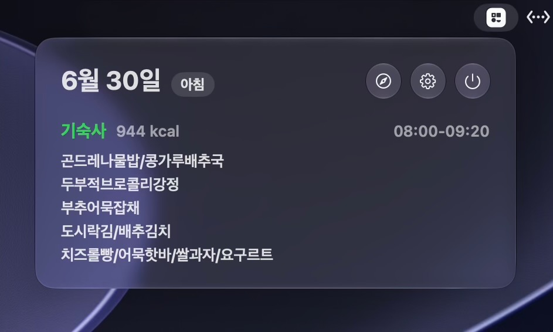

# Babbar

식단표 정보를 macOS 메뉴바에서 바로 확인하는 위젯입니다.

## 화면

## 요구 사항

- macOS 26 이상
- Apple Silicon

## 설치

- [Releases](https://github.com/beaulowo/babbar-macos/releases/latest)에서 dmg 파일을 받은 뒤 `Babbar.app`을 `Applications`로 드래그. 
- "‘Babbar.app’을(를) 열지 않음" 팝업이 뜨면 설정 - 개인정보 및 보안 - 그래도 열기 클릭

## 사용

- 메뉴바의 Babbar 아이콘을 누르면 현재 시각 기준 식단표가 표시됩니다.
- 식사 시간이 지나면 다음 식단표로 자동 전환됩니다.
- 설정 버튼에서 로그인 시 자동 실행을 켤 수 있습니다.
- 설정 버튼에서 업데이트를 확인할 수 있습니다.

## 라이선스

GPL-2.0
